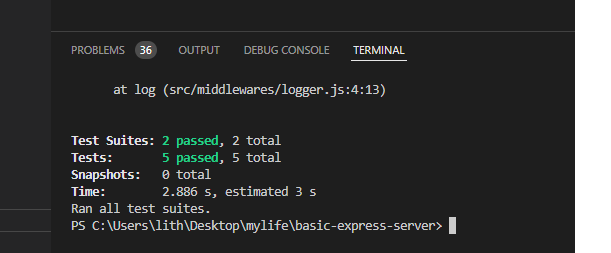

# basic-express-server
## 🚀 heroku link
https://bassic-express-server.herokuapp.com/

## 🚀 pull request
https://github.com/lithhalim/basic-express-server/pulls

## 🚀 action
https://github.com/lithhalim/basic-express-server/actions

## How To Use
- Insert the Name

- when you dont insert any thing

- when tou nsert number

- the console log the url

- the test of program

## DECMUNTATION

- Create a new repository called basic-express-server
- index.js at the root of your repository, which will act as the “entry point” to your server
- src/server.js which will serve as your server ‘module’ … will contain all of the module connections for the server
##### Create a middleware folder and add 2 middleware modules to it:
 ###### logger.js
  - Performs a console.log with the request method and path
 - Import this into your server and set it up to run at the application level for all routes
###### validator.js
- Checks the query string for a name property
- Sends the request through when valid, forces an error when not

