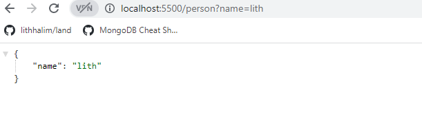
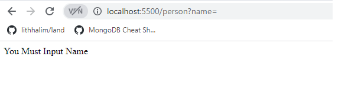
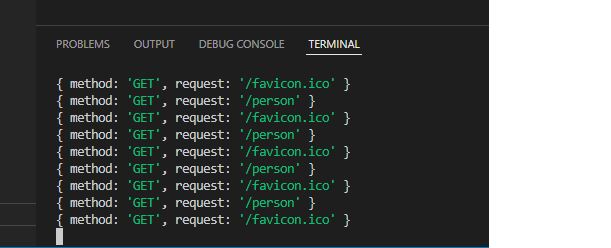

# basic-express-server
## 🚀 heroku link
https://bassic-express-server.herokuapp.com/

## 🚀 pull request
https://github.com/lithhalim/basic-express-server/pulls

## 🚀 action
https://github.com/lithhalim/basic-express-server/actions

## How To Use
- Insert the Name

- when you dont insert any thing

- when tou nsert number

- the console log the url

